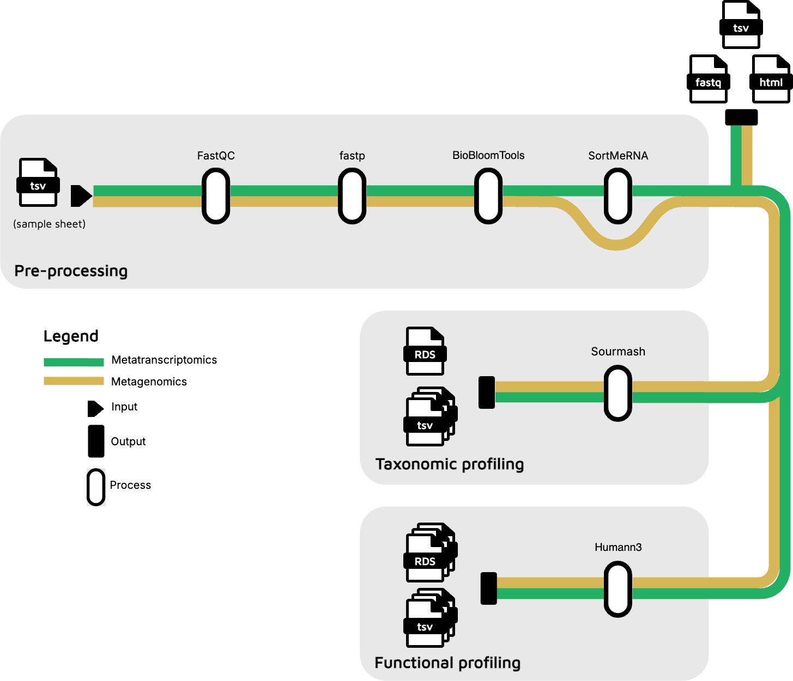

# doubleshot





[](https://www.nextflow.io/)
[](https://opensource.org/licenses/MIT)


## Overview

Doubleshot is a Nextflow pipeline for taxonomic and functional profiling of shotgun metagenomics and metatranscriptomics data. It provides a streamlined, reproducible workflow for analyzing microbial communities from environmental samples, utilizing the GTDB taxonomy whenever possible. 

## Key Features

- 🧬 **Dual Profiling**: Combined taxonomic and functional analysis in a single pipeline
- 🔄 **Reproducibility**: Containerized workflow ensures consistent results
- 📊 **Visualization**: Built-in reporting and visualization capabilities
- ⚙️ **Flexibility**: Works with both metagenomics and metatranscriptomics data
- 🚀 **Scalability**: Efficiently processes large datasets on various computational infrastructures


## Quick Start

```bash
# Install Nextflow
curl -s https://get.nextflow.io | bash

# Run Doubleshot with test data
nextflow run SJohnsonMayo/doubleshot -profile test,docker

# Run with your data
nextflow run SJohnsonMayo/doubleshot \
  --input samplesheet.csv \
  --outdir results \
  -profile docker
```


## Requirements

- [Nextflow](https://www.nextflow.io/) (>=21.10.0)
- Container engine: Docker, Singularity, or Conda

## Example Workflow


The Doubleshot pipeline consists of the following main steps:

1. **Quality Control**: Read preprocessing and filtering
2. **Host Removal**: Removal of host DNA (optional)
3. **Taxonomic Profiling**: Species identification and abundance estimation
4. **Functional Profiling**: Gene and pathway analysis
5. **Report Generation**: Integrated summary reports and visualizations

## Input

The pipeline requires paired-end  reads in FASTQ format (compressed or uncompressed). Input is specified through a samplesheet TSV file:

```tsv
sampleID	fastq_1	fastq_2	sample_type
SAMPLE1	/path/to/sample1_R1.fastq.gz	/path/to/sample1_R2.fastq.gz	metagenomic
SAMPLE2	/path/to/sample2_R1.fastq.gz	/path/to/sample2_R2.fastq.gz	metatranscriptomic
```

# Nextflow Configuration Parameters

The following table describes the parameters available in the `nextflow.config` file for the Doubleshot pipeline:

| Parameter | Description | Example |
|-----------|-------------|---------|
| `db_base_dir` | Base directory for all database files | `/path/to/databases` |
| `bloom_db_dir` | Directory containing Bloom filter databases | `"${params.db_base_dir}/bloom"` |
| `sortmerna_db_dir` | Directory containing SortMeRNA reference databases | `"${params.db_base_dir}/sortmerna"` |
| `sourmash_db_dir` | Directory containing Sourmash databases | `"${params.db_base_dir}/sourmash"` |
| `humann_db_dir` | Directory containing HUMAnN databases | `"${params.db_base_dir}/humann"` |
| `bowtie2_path` | Path to Bowtie2 executable | `/usr/local/bin/bowtie2` |
| `sortmerna_dbs` | List of SortMeRNA database files | `["${params.sortmerna_db_dir}/rfam-5.8s-database-id98.fasta", "${params.sortmerna_db_dir}/silva-arc-16s-id95.fasta"]` |
| `sourmash_db` | Path to Sourmash k-mer database file | `"${params.sourmash_db_dir}/gtdb-rs214-k31.zip"` |
| `sourmash_tax` | Path to Sourmash taxonomy file | `"${params.sourmash_db_dir}/gtdb-rs214-taxonomy.csv"` |
| `humann_test_protein_db` | Path to HUMAnN test protein database | `"${params.humann_db_dir}/uniref90_test_diamond"` |
| `humann_protein_db` | Path to HUMAnN protein database | `"${params.humann_db_dir}/uniref90_201901b_diamond"` |
| `humann_nuc_db` | Path to HUMAnN nucleotide database | `"${params.humann_db_dir}/chocophlan"` |
| `humann_map_dir` | Path to HUMAnN mapping directory | `"${params.humann_db_dir}/utility_mapping"` |
| `humann_test_args` | HUMAnN arguments for test runs | `"--bypass-nucleotide-search --threads 4 --memory-use minimum"` |
| `humann_prod_args` | HUMAnN arguments for production runs | `"--threads 16 --bypass-nucleotide-index --search-mode uniref90 --remove-temp-output"` |


## Usage Notes

1. **Database Directories**:
   - You can set the `db_base_dir` parameter to point to your institutional database storage location
   - Individual database directories can be specified separately if they are stored in different locations

2. **Tool Paths**:
   - Use `bowtie2_path` to specify a custom Bowtie2 executable location when the default PATH isn't suitable

3. **Database Files**:
   - For `sortmerna_dbs`, provide a list of reference database files in the format `["path/to/db1", "path/to/db2"]`
   - Specify the full paths to Sourmash and HUMAnN database files for taxonomic and functional profiling
   - Sourmash databases are available at the sourmash website: https://sourmash.readthedocs.io/en/latest/databases.html
   - HUMAnN databases are available from the Struo2 group (http://ftp.tue.mpg.de/ebio/projects/struo2/) or from using HUMAnN's humann_databases.py script


## Output

The pipeline generates:

- Filtered, quality-controlled reads
- Taxonomic profiles as generated by Sourmash
- Functional profiles as generated by Humann3, grouped by MetaCyc pathways, GO, KO, and EC annotations
- Pipeline execution logs and metrics

## Citation

If you use this pipeline in your research, please cite:

```
Johnson S, et al. (2025) Doubleshot: A Nextflow pipeline for taxonomic & functional 
profiling of shotgun metagenomics and metatranscriptomics data. GitHub: 
https://github.com/SJohnsonMayo/doubleshot
```


## License

This project is licensed under the MIT License - see the [LICENSE](LICENSE) file for details.

## Acknowledgements

This pipeline uses several open-source bioinformatics tools. We acknowledge their developers and contributors.

## Contact

For questions or support, please [open an issue](https://github.com/SJohnsonMayo/doubleshot/issues) on GitHub.

